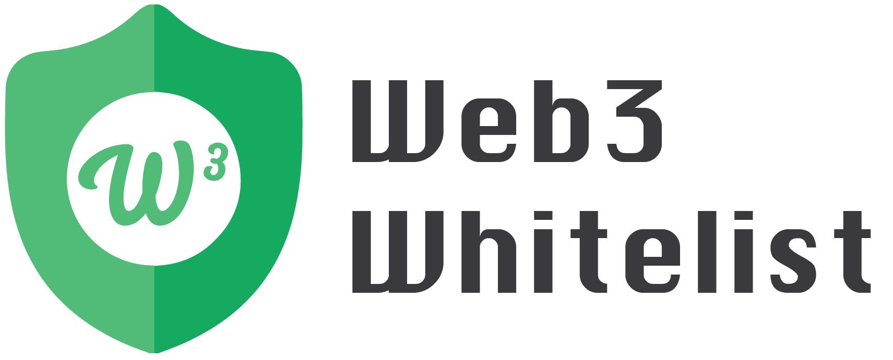
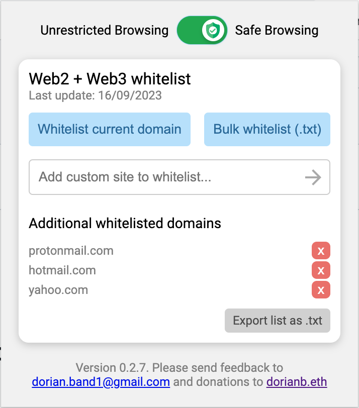

# Web3 Whitelist Chrome Extension

## Table of Contents

- [Introduction](#introduction)
- [Features](#features)
- [Installation](#installation)
- [Usage](#usage)
  - [Popup UI](#popup-ui)
  - [Background Script](#background-script)
- [Screenshots](#screenshots)
- [Technologies Used](#technologies-used)
- [Contributing](#contributing)
- [FAQs](#faqs)
- [Changelog](#changelog)
- [License](#license)
- [Contact/Support](#contactsupport)
- [Donations](#donations)

## Introduction

Navigating the web3 ecosystem, including decentralized finance (DeFi), wallet interfaces, and NFT marketplaces, poses security risks from malicious sites. The Web3 Whitelist Chrome Extension addresses these challenges. It restricts browser access to a predefined list of trusted domains, reducing exposure to phishing and scams. Leveraging Chrome's declarative net request API, the extension ensures only whitelisted domains are accessible. Moreover, the extension is completely free to use.

## Features

- **Domain Whitelisting**: Only allows access to a predefined list of trusted domains.
- **Background Initialization**: Loads a fixed whitelist from `fixed_whitelist.txt` upon installation.
- **Toggle Safe Browsing**: Switch between safe and unrestricted browsing from the popup UI.
- **Whitelist Management**: Add or remove domains from the whitelist directly from the popup.
- **Bulk Upload**: Ability to bulk add domains to the whitelist from a file.
- **Display Extension Version**: Shows the current version within the popup.
- **Last Updated**: Displays the last modification date of the fixed whitelist.

## Installation

The Web3 Whitelist Extension is currently undergoing review of the google chrome extension store. 

(For now) To install the Whitelist Chrome extension, follow these steps:

1. Download the .zip file and extract
2. Navigate to `chrome://extensions/` in your Chrome browser.
3. Enable `Developer mode` by toggling the switch in the top right corner.
4. Click on `Load unpacked` and select the folder containing the downloaded files.

## Usage

### Popup UI

- **Toggle Safe Browsing**: A slider for switching between "Safe Browsing" and "Unrestricted Browsing".
- **Add Custom Domain**: Enter any website or domain into the text field.
- **Add Current Domain**: A button to directly add the active tab's domain to the whitelist.
- **Bulk Upload**: Upload a list of domains from a file to the whitelist.
- **Whitelist Management**: View, add, or remove domains from the whitelist.

### How does it work?

- **Initialization**: Sets up a fixed whitelist from `fixed_whitelist.txt` upon installation.
- **User Whitelist**: Listens for user entries and adds them to a user-defined whitelist.
- **Update Rules**: Merges the fixed whitelist and user-defined whitelist, then updates the browsing rules accordingly.

## Screenshots

## Contributing

To contribute, please send domain suggestions for inclusion, report any bugs you encounter, or provide feedback on the extension's functionality. Your input helps improve the tool for everyone.

## Changelog

- **0.2.7** - First public release

## License

The Web3 Whitelist Chrome Extension is licensed under the MIT License. The MIT License is a permissive free software license that allows for reuse within proprietary software provided all copies of the licensed software include a copy of the MIT License terms. Such open-source software is free to use, modify, and distribute, subject to conditions preserving the copyright notice and disclaimer.

## Legal Disclaimer

The Web3 Whitelist Chrome Extension is provided "as is" without any warranty of any kind, either expressed or implied. Users of the extension are solely responsible for their actions and outcomes when using it. I, the developer, am not liable for any damages, losses, or security breaches that might occur due to bugs, flaws, hacking attempts, or any other unforeseen vulnerabilities inherent within the extension or its dependencies.

## Contact/Support

For inquiries or support, contact: [dorian.band1@gmail.com](mailto:dorian.band1@gmail.com).

## Donations

Support the development by making a donation to `dorianb.eth`. Your support is greatly appreciated!

